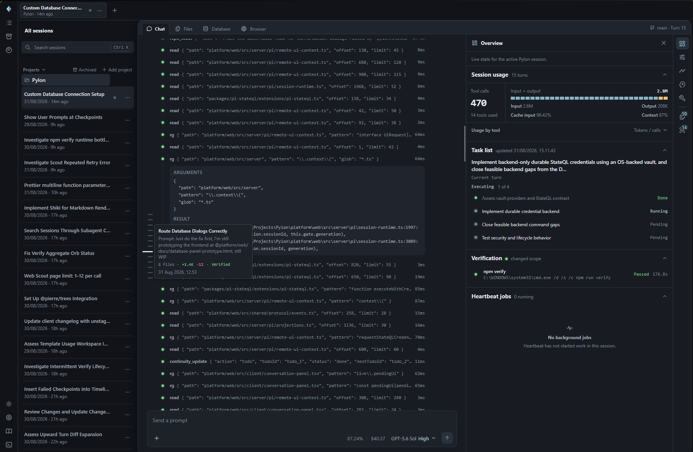

# Pylon

Pylon is a web-first coding agent workspace built on [Pi](https://pi.dev). It combines planning, repository research, delegated implementation, verification, safety controls, checkpoints, and a low-noise interface in one bundle.

Pylon is optimized for **cost efficiency and output quality rather than speed**. It routes focused work to cost-effective models and reserves stronger models for decisions that benefit from them, while verification and specialist reviews help protect quality. This workflow can take longer than using a single model directly.



## What Pylon Does

- **Deterministic compaction**: Continuity intercepts manual and automatic `/compact` and rebuilds context from structured session state (goal, plan, todos, constraints, verification, file activity) instead of asking a model to summarize. An optional Compaction Reviewer can refine the result, and any failure falls back to the deterministic one.
- **Specialized subagents**: Advisor (tool-free reasoning for architecture and failure recovery), Scout (bounded repo and public-web reconnaissance), Grunt (delegated implementation in an isolated Git worktree), and Spawn (resumable private threads and child sessions). Each has its own model, so cheap models do the volume and strong models do the decisions.
- **File indexing**: Discover keeps a machine-local SQLite index of Git-tracked source files, refreshed on session start and reconciled per turn, backing `symbol_search` and `code_search` so lookups don't cost a full-repo grep. Repositories shared by several workspaces are indexed once.
- **Bounded context**: Sieve trims old bulky tool output from outbound context without touching stored messages, Discover keeps optional tool schemas deferred until `search_tools` activates them, and every package caps its own output.
- **Checkpoints and safety**: Timeline takes Git-backed filesystem checkpoints tied to each prompt so you can list, restore, or fork them; Guard intercepts destructive shell and file operations and requires confirmation.
- **Verification built in**: Verify detects and runs your existing project checks under a time and output budget, and task completion is gated on the result.
- **Planning and task lists**: Explicit plan mode with structured clarifications, a visible task list, and optional `/plan review`.
- **Tool-aware memory**: Durable workspace notes that activate on typed lifecycle and tool events rather than fuzzy prompt similarity. A note attached to a path or tool surfaces when you actually touch it, once per session.

## Web App Setup (Recommended)

Requires Node.js 22.19 or newer.

```sh
npm install --global @fadhilp/pylon
cd /path/to/your/project
pylon
```

Open [http://127.0.0.1:3141](http://127.0.0.1:3141) (loopback only) and use **Settings** to configure providers, package models, and package options. Recommended for OpenAI subscriptions: main GPT 5.6 Sol Medium, Advisor Sol High, Scout Luna Medium, Grunt Terra.

- `PYLON_CWD` sets the project directory, `PYLON_PORT` the port (`3141`), `PYLON_NO_UPDATE_CHECK=1` disables the startup update check.
- Sessions, settings, and package state live in `~/.pylon/agent` (`PI_CODING_AGENT_DIR` overrides). Existing `~/.pi/agent` data is copied on first run; `pylon migrate` retries.
- Manage Pi-native extensions in **Settings → Extensions**. Extensions run arbitrary code with the server's permissions — review sources before enabling.

## Terminal Setup (Alternative)

Requires an existing [Pi](https://pi.dev) install (the web app bundles its own).

```sh
pi install npm:@fadhilp/pylon   # or an absolute path to a local checkout
```

Reload Pi with `/reload`, then pick models for the child agents — they stay unavailable until configured:

```text
/advisor
/grunt
/scout
```

Each command opens a model selector in TUI mode; `reset` uses the current main model, `disable` turns it off, `status` shows configuration. Run `/pylon doctor` to check models, credentials, dependencies, and package health.

## Bundled Packages

| Package | What it does |
| --- | --- |
| [pylon-core](./packages/pylon-core) | Coordinates tool policies across packages; adds revision-guarded numbered read/edit tools and per-tool token reporting. |
| [pi-continuity](./packages/pi-continuity) | Plan mode, task lists, clarifications, deterministic compaction, and durable tool-aware memory. |
| [pi-advisor](./packages/pi-advisor) | Asks a tool-free model for help on hard planning, architecture review, and failure recovery. |
| [pi-grunt](./packages/pi-grunt) | Delegates implementation slices to a worker running in an isolated Git worktree. |
| [pi-scout](./packages/pi-scout) | Bounded repository reconnaissance and isolated public-web research. |
| [pi-spawn](./packages/pi-spawn) | Private resumable subagent threads and first-class child sessions. |
| [pi-discover](./packages/pi-discover) | Indexes sources, searches the repo and past Pi sessions, and activates deferred tools via `search_tools`. |
| [pi-sieve](./packages/pi-sieve) | Trims old bulky tool output from outbound context, leaving stored messages intact. |
| [pi-timeline](./packages/pi-timeline) | Git-backed checkpoints per prompt: list, restore, fork, clear. |
| [pi-guard](./packages/pi-guard) | Confirms or blocks destructive shell and file operations. |
| [pi-verify](./packages/pi-verify) | Finds and runs your project's existing checks with bounded time and output. |
| [pi-heartbeat](./packages/pi-heartbeat) | Runs bounded background shell jobs you can check or cancel. |
| [pi-helios](./packages/pi-helios) | Consent-gated Playwright browser, Appium Android emulator, and Windows window capture. |
| [pi-stateql](./packages/pi-stateql) | Safe stateful database queries with durable result handles and confirmed writes. |
| [pi-papercut](./packages/pi-papercut) | Durable backlog for small workflow frictions. |
| [pi-focus](./packages/pi-focus) | Low-noise Pi terminal UI and the `focus-dark` theme. |

Each package works standalone; with Pylon installed they coordinate through bounded, versioned event-bus metadata — Verify results gate Continuity completion and mark Timeline checkpoints, Guard requests a checkpoint before destructive confirmation, Heartbeat publishes job lifecycle, and Scout receives bounded verification context. Raw verification and Heartbeat logs never cross package events. See each package README for details.

## Development

Install workspace dependencies and start the local web app from the repository root. The root `package-lock.json` is the only workspace lockfile; do not generate package-level locks.

```sh
npm run install:packages
npm run web
```

For development without a production build, run `npm run dev --workspace @pylon/web`.

On Windows, use workspace-relative temporary files when passing paths between Git Bash and native Node/Pylon tools; MSYS paths such as `/tmp/...` are not native Windows paths. Stop a running Pylon process or use a separate worktree/copy before `npm ci`, because Windows cannot replace native addons loaded by the active process.
